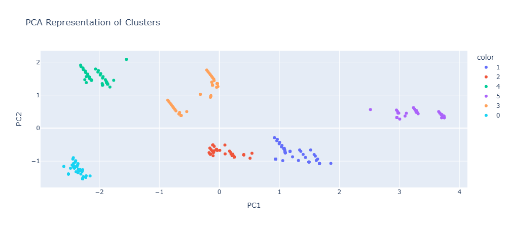

## Analysis of Customer Behaviour and Segmentation (Complete.)

<p align="center">
  
</p>

## Project Overview

This project focuses on exploring customer engagement and purchasing patterns.  
The goal is to segment customers into clusters based on their behavioural and demographic attributes.

---
## Tech Stack

- Python 3.13.10
- Pandas, NumPy, Scikit-learn
- KMeans Clustering
- MongoDB
- Streamlit
- YAML-based configuration
- GitHub for version control

---

## Project Objectives & Approach

* **Data Cleaning and Transformation:**  
  Handle missing values and apply one-hot encoding to categorical variables.

* **Feature Engineering:**  
  Prepare meaningful features from transactional and demographic data.

* **Data Preprocessing:**  
  Apply feature scaling and encoding to standardize the dataset and improve the clustering process.

* **Customer Segmentation using KMeans Clustering:**  
  Segment customers into distinct groups using K-Means clustering to enable targeted marketing and personalization.

* **Cluster Replication using Classification Models:**  
  Train supervised classification models on cluster labels to learn and reproduce cluster assignments on unseen data.

* **Cluster Evaluation:**  
  Evaluate the trained classifier using accuracy and classification metrics to ensure consistent cluster prediction.

---

## Data Source

Dataset sourced from Kaggle:  
[https://www.kaggle.com/datasets/uom190346a/e-commerce-customer-behavior-dataset](https://www.kaggle.com/datasets/uom190346a/e-commerce-customer-behavior-dataset)

The dataset was uploaded to a cloud-hosted database and ingested directly into the pipeline.

---

## Dataset Description

* Customer ID – Integer  
* Gender – Categorical  
* Age – Integer  
* City – Categorical  
* Membership Type – Categorical  
* Total Spend – Numeric  
* Items Purchased – Integer  
* Average Rating – Numeric  
* Discount Applied – Boolean  
* Days Since Last Purchase – Integer  
* Satisfaction Level – Categorical  

---

## Notes on Model Evaluation

This is a cluster segmentation project that uses cluster labels as artificial labels, **cluster-generated labels** (pseudo-labels from KMeans) to train Supervised Learning models.  
As a result, high classification accuracy reflects the model’s ability to **replicate cluster boundaries**, rather than predict a natural ground-truth label.

---

## Project Structure

The project is structured around modular data science pipelines implemented in the src/components and src/pipeline packages. Configuration is managed centrally via YAML files and configuration classes. Experiments and exploratory work are tracked in versioned notebooks. Persistent storage is handled through MongoDB using the persistence module, and a Streamlit UI enables real-time customer inference.

---

## How to Run the Project

Clone the Repo:
```bash```
  1. git clone https://github.com/okanina/customer_segmentation.git
    cd customer_segmentation
  2. python -m venv venv
  3. pip install -r requirements.txt
  4. Run training pipeline: python src/pipeline/training_pipeline.py
  5. Assign historic data to their cluster: python src/persistence/historic_upsert.py
  6. Launch streamlit app for real-time inference: streamlit_app.py
     
---
 
## Prediction Pipeline Demo


---

## Result and Insights

After Clustering: The following clusters and Insights were identified

**cluster 1 and 5**: High-spending loyal customers and high satisfation. Cluster 5 with high frequent purchases.
**cluster 2 and 3**: Moderate spenders, mostly neutral and disatisfied customers at-risk of churning customers
**Cluster 0 and 4**: Low spenders, also mostly neutral and disatisfied customers at-risk of churning customers.

These segments enable targeted marketing strategies, such as loyal reward to customers that are associated with clusters that are at risk of churning. The segments are also good for taylored recommentations.

<p align="center">
  
</p>
---

## Limitations

- Labels are not ground truth they are pseudo-labels
- Data seems to be synthentic + static which does not reflect real-world seasonality 

## Future Work

* Use AWS Secrets Manager to securely store database credentials.
* Migrate data storage to AWS DynamoDB and S3 for scalable ingestion and model storage.
* Implement CI/CD using GitHub Actions, AWS Elastic Beanstalk, and AWS CodePipeline.
